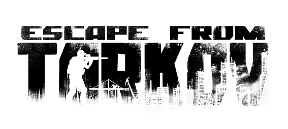

# Proyecto_API_REST_GrzegorzArturDryka

El proyecto está realizado únicamente por _`Grzegorz Artur Dryka`_.
La idea de la api es tratar datos de las partidas que están siendo jugadas.

## FuentesAAAAAAAAAAAA

La API está basada en un videojuego llamado "**_Escape from Tarkov_**", y más concretamente en una de sus wikis. Dicha wiki posee una api https://tarkov.dev/api/ que funciona con `GraphQL`.

El código usado es el aprendido con las prácticas de ejemplo subidas en el aula virtual y recursos de internet. 

## Lógica sql

Explicando brevemente mi proyecto, la base de datos sql localizada en [data.sql](src/main/resources/data.sql) posee 3 tablas: **Pmc**, **Scav** y **Mapa**. 

Sin explicar en profundidad el funcionamiento del juego para comprender la relación entre los tres, `uno o varios pmcs` y `uno o varios scavs` juegan en un mapa. Una partida en un mapa concreto comienza y termina en el mismo, por ello el mapa se puede repetir, pero tiene `distinta id` de partida.

## Ubicación peticiones Postman

Las peticiones exportadas **_Postman_** están localizadas en este [json](src/main/resources/peticiones api Tarkov.postman_collection.json).